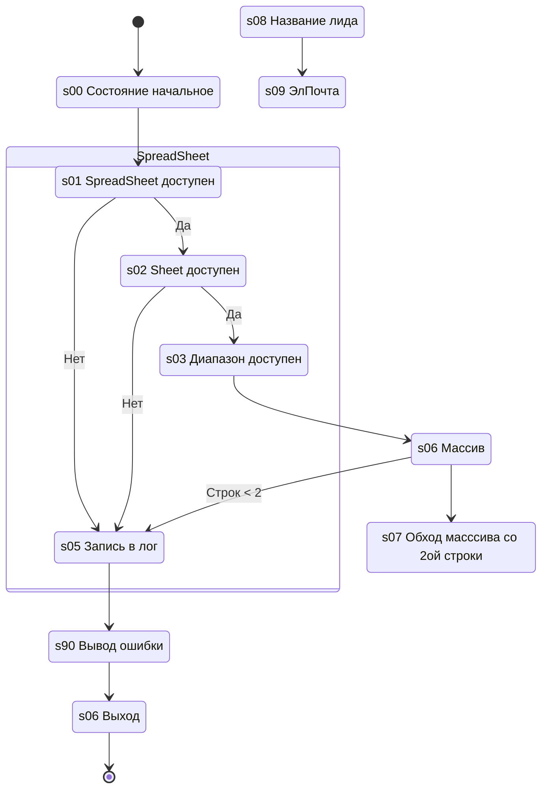

```mermaid
stateDiagram-v2
s00: s00 Состояние начальное
s01: s01 SpreadSheet доступен
s02: s02 Sheet доступен
s03: s03 Диапазон доступен
s05: s05 Запись в лог
s06: s06 Массив
s07: s07 Обход масссива со 2ой строки
s08: s08 Название лида
s09: s09 ЭлПочта 
s90: s90 Вывод ошибки
s99: s06 Выход
[*] --> s00 
s00 --> s01
state SpreadSheet {
s01 --> s02: Да
s01 --> s05: Нет
s02 --> s03: Да
}
s02 --> s05: Нет
s03 --> s06
s06 --> s05: Строк < 2
s06 --> s07
s08 --> s09
s05 --> s90
s90 --> s99
s99 --> [*]
```