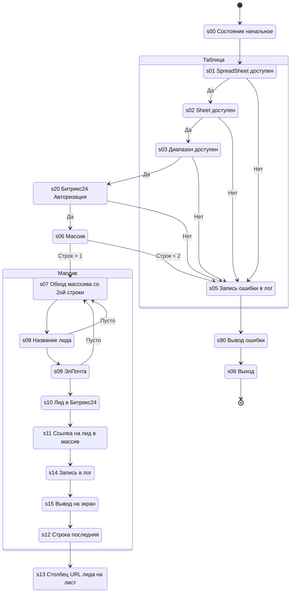

```mermaid
stateDiagram-v2
s00: s00 Состояние начальное
s01: s01 SpreadSheet доступен
s02: s02 Sheet доступен
s03: s03 Диапазон доступен
s05: s05 Запись ошибки в лог
s06: s06 Массив
s07: s07 Обход масссива со 2ой строки
s08: s08 Название лида
s09: s09 ЭлПочта 
s10: s10 Лид в Битрикс24
s11: s11 Ссылка на лид в массив
s12: s12 Строка последняя
s13: s13 Столбец URL лида на лист
s14: s14 Запись в лог
s15: s15 Вывод на экран

s20: s20 Битрикс24 Авторизация

s90: s90 Вывод ошибки
s99: s06 Выход

[*] --> s00 
s00 --> s01
state Таблица {
s01 --> s02: Да
s01 --> s05: Нет
s02 --> s03: Да
}
s02 --> s05: Нет
s03 --> s20: Да
s20 --> s06: Да
s20 --> s05: Нет 
s03 --> s05: Нет
s06 --> s05: Строк < 2
s06 --> s07: Строк > 1
state Массив {
s07 --> s08
s08 --> s09
s08 --> s07: Пусто
s09 --> s10
s09 --> s07: Пусто
s10 --> s11
s15 --> s12
s11 --> s14
s14 --> s15
}
s12 --> s13
s05 --> s90
s90 --> s99
s99 --> [*]
```